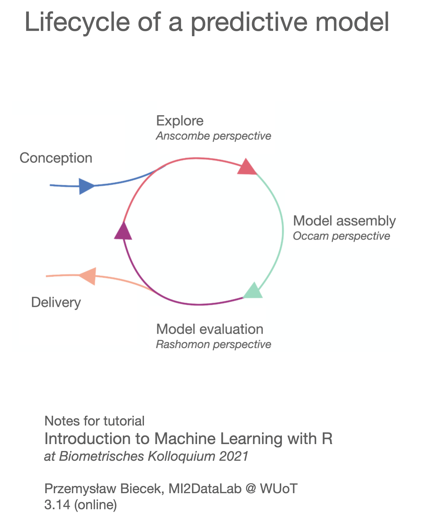

# BioColl2021 

Notes for the tutorial *Introduction to Machine Learning with R* given at [Biometrisches Kolloquium 2021](http://www.biometrisches-kolloquium2021.de/en/startseite-english/).

## Short link

Short link to this page: [https://tinyurl.com/BioColl2021](https://tinyurl.com/BioColl2021)

## Scripts

* [Markdown file](introduction_to_ml.Rmd)
* [HTML file](https://htmlpreview.github.io/?https://raw.githubusercontent.com/pbiecek/BioColl2021/main/introduction_to_ml.html)

## Data

Please, note that these are artificial datasets generated to mimic relations present in the real data.

* [covid_spring.csv](covid_spring.csv)
* [covid_summer.csv](covid_summer.csv)

